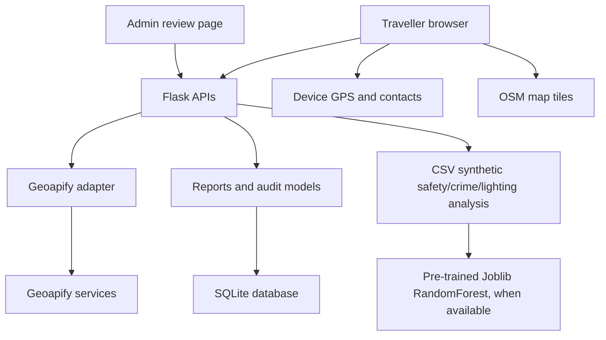

# SafeWalk Simple architecture

## Goal

One complete traveller flow: choose locations → select a route → navigate → access help/share → check in. Administrative review is a separate interface.

## Modules

| Path | Responsibility |
|---|---|
| `run.py` | App entry point; local development server |
| `app/__init__.py` | App factory, configuration, CSRF, sessions, headers, rate limiting, admin CLI |
| `app/routes.py` | Thin HTTP handlers for places, routes, nearby help, reports and admin |
| `app/services/geoapify.py` | Bounded external requests, route normalization and geometric duplicate detection |
| `app/models.py` | Admin, Report and Audit persistence |
| `app/templates/` | Traveller and admin screens |
| `app/static/app.js` | Map, location search, GPS guidance, contact storage and explicit sharing |
| `app/static/style.css` | Responsive layout and fullscreen navigation |
| `tests/test_app.py` | Isolated workflow, ownership, validation and provider-normalization tests |

One Flask process is enough for local use. Nearby help retains the existing
Geoapify provider. Lighting observations are fictional CSV rows and are matched
against each route's actual geometry; a pre-trained Joblib model is loaded when
available, otherwise the UI uses a clearly labeled distance-weighted data
fallback. The model is trained offline, never in a request. See
[synthetic lighting and ML details](LIGHTING.md). Leaflet/OSM provide the base map.

## Persistence

| Data | Storage |
|---|---|
| Admin credentials | Database; password hash only |
| Reports | Database with hashed visitor ownership |
| Review actions | Database audit trail |
| Emergency contacts | Browser localStorage |
| Current journey/route candidates | Browser memory only |
| Navigation GPS fixes | Browser memory only |
| API key and Flask secret | Server `.env`/deployment environment |

Synthetic route-card metrics are calculated independently for each route from the bundled safety, crime, and lighting CSVs. They are not verified real-world measurements. When all metrics exist, the documented demo formula can recommend a route; otherwise the provider's fastest route is selected. SQLite is deliberate: no real spatial safety analysis is implemented. Do not reuse the old project's database; this schema does not replace its migrations.

## APIs

| Endpoint | Method | Purpose |
|---|---|---|
| `/api/search?q=...` | GET | India place suggestions |
| `/api/reverse?lat=...&lng=...` | GET | Current-location label |
| `/api/routes` | POST | Up to three provider candidates with route-specific synthetic ratings and documented demo recommendation |
| `/api/help?lat=...&lng=...` | GET | Deduplicated police, hospital and pharmacy listings within a server-enforced 5 km radius; cached for five minutes |
| `/api/reports` | GET/POST | Own reports / submit report |
| `/api/reports/<id>` | DELETE | Delete an owned report |
| `/admin/login` | GET/POST | Admin authentication |
| `/admin/` | GET | Report review and recent audit history |
| `/admin/reports/<id>` | POST | Audited moderation |
| `/admin/logout` | POST | Admin sign out |
| `/health` | GET | Process health, safety_scoring=false |

Browser mutations carry a session CSRF token. Admin HTML forms use a hidden token. Traveller cookies cannot read another traveller's reports. Forms and rendered report text are escaped; dynamic UI uses textContent rather than inserting user-provided HTML.

## Feature decisions

| Decision | Features |
|---|---|
| Keep | Map/search, current location, modes, distance/ETA, route selection, navigation, contacts, reporting |
| Simplify | Up to three distinct route candidates, one Nearby help control, one admin review panel |
| Add | Share journey/location, arrival check-in, own report status/deletion, clear errors and privacy text |
| Remove from this build | Dataset registry/import, source auditing/sync, OSM replication, PostGIS queries, route history, old overview |
| Defer | Verified evidence comparison, Home/Work saved places, photos, traveller accounts, background alerts and live sharing |
| Synthetic demo data | Route-specific safety, crime risk, and lighting metrics, explicitly labeled DEMO |
| Disable/omit | Real safety score, real crime-risk evidence, OSM lighting requests/caches/overlays |

The current app retains three provider route candidates and its existing navigation workflow. Synthetic scores and recommendation output remain explicitly labeled as demo-only.
